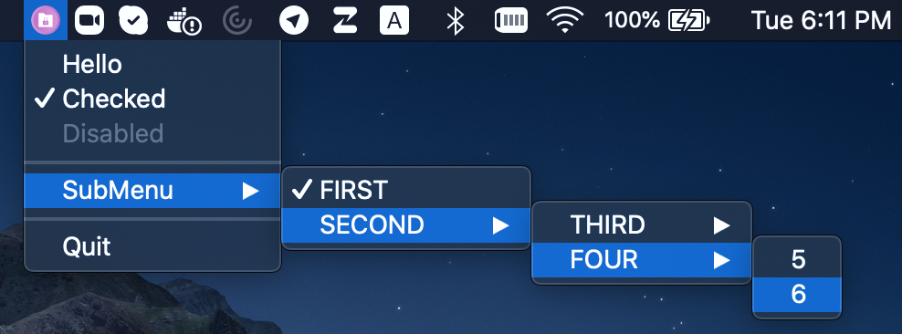

# System Tray / Menu Bar / Indicator Icon

Cross-platform, super tiny C99[^1] implementation of a system tray/menu bar icon with popup menu.

The optional primary-click callback can hide/show a window while secondary-click shows a menu.  
If no callback is specified, either click will show the menu.

The system can be dynamically updated; icon, tooltip, menu items and status (checked/unchecked &
enabled/disabled) can all be both queried and changed at runtime. Code is C++ friendly and will 
compile fine in C++98 and up on Windows or Mac but requires C++17 on Mac.  This fork is intended 
to make the functionality available as a library, for use from other languages.

[^1]: At least it's super tiny and C99 on Mac & Windows.

Focussed PRs are welcome, especially improvements to the Linux implementation.  The goal is to 
keep the code as simple as possible, so functionality beyond presenting a tray icon and menu is 
out of scope.

## Cross-platform

Works well on:

* Windows XP or newer (shellapi.h)
* MacOS (Cocoa/AppKit)
* Linux/Gtk (Qt6)

Gnome has decided to deprecate the tray icon as a concept, except for system indicators. They have 
not only deprecated the tray-handling code but removed it entirely.  Extensive investigation has
failed to produce a reliable way to display tray icons, even using low-level X11 calls.  Qt _has_ 
worked out a way to do it, so we are currently using their implementation on Linux, which 
unfortunately requires C++ and much larger dependencies.  All of the Qt code is isolated in the
library, so use of Qt is not required in application code (although it will use the application's 
QApplication instance, should one exist).

PRs that resolve this situation are very welcome!

## API

The `tray` structure defines the tray and a nested menu of NULL-terminated array of entries.
`tray_menu_item` defines each menu entry text, menu checked and disabled (grayed) flags.

The `tray` and `tray_menu_item` each have an optional callback if they are selected.

```c
struct tray {
  const char *icon_filepath;
  char *tooltip;
  void (*cb)(struct tray *); // called on left click, leave null to just open menu
  struct tray_menu_item *menu; // NULL-terminated array of menu items
};

struct tray_menu_item {
  char *text;
  int disabled;
  int checked;
  void (*cb)(struct tray_menu_item *);
  struct tray_menu_item *submenu; // NULL-terminated array of submenu items
};
```

* `int tray_init(struct tray *)` - creates tray icon. Returns -1 if tray icon/menu can't be created.
* `struct tray * tray_get_instance()` - returns the tray instance.
* `void tray_update(struct tray *)` - updates tray icon and menu.
* `int tray_loop(int blocking)` - runs one iteration of the UI loop. Returns -1 if `tray_exit()` has been called.
* `void tray_exit()` - terminates UI loop.

All functions are meant to be called from the UI thread only.

Menu arrays must be terminated with a NULL item, e.g. the last item in the
array must have text field set to NULL.

## Icons

Icons are platform-specific but generally should have transparent backgrounds and be simple (since 
they are tiny).

Tray does not provide any theming or icon management.  It is up to the application to respond
to theme changes and supply appropriate icons e.g. dark mode.

| Platform | Icon format                                                                             |
|---------|:----------------------------------------------------------------------------------------|
| Windows | .ICO with 16x16 & 32x32 sizes included                                                  |
| MacOS   | .PNG with a notional 22pt height or vector-based .PDF (recommend black or white images) |
| Linux   | .PNG 24x24 pixels                                                                       |

## Prerequisites

* CMake
* [Ninja](https://ninja-build.org/), in order to have the same build commands on all platforms
* Qt6 on Linux: `sudo apt install build-essential libgl1-mesa-dev qt6-base-dev`

## Building

```
mkdir build
cd build
cmake -G Ninja ..
ninja
```

## Demo

Build & execute the `tray_example` application:

```
./tray_example
```

## Screenshots




## History

This fork is in turn based on a previous [fork by dmikushin](https://github.com/dmikushin/tray) that brings together the
[original work of Serge Zaitsev](https://github.com/zserge/tray) and "the most interesting forks and PRs of
respectable contributors" including:

* [Only process messages coming from the tray window on Windows](https://github.com/zserge/tray/pull/18)
* [Become C++-friendly](https://github.com/zserge/tray/pull/16)
* [Fix all menu items have a check box](https://github.com/zserge/tray/pull/11)
* [Add support for tooltip](https://github.com/zserge/tray/pull/11)
* Darwin implementation translated from C to Objective C adapted from [@trevex fork](https://github.com/trevex/tray)
